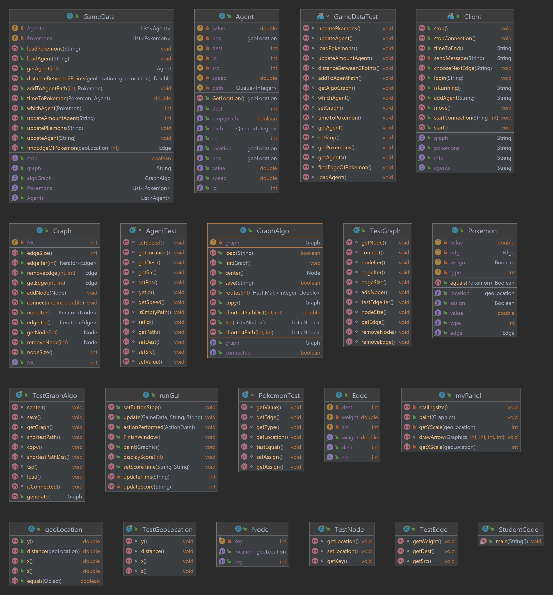

# OOP-Ex4

# Readme

#### Hand in by 208483008,322697483 and 207900440

## preface

This is a readme for our oop-Ex2- planing and design directed weighted graph. Please follow those instructions:

1. In section "2. About this project" you could find an explanation about this project.
2. In section "3. Implementation" you can take a deeper look on the algorithms we actualized
3. In section "4. Analysis Algorithms" you could find a complete Analytics of our project.
4. In section “5. Dependencies” you can find which libraries are in the base of our project
5. In section “6. UML” there is our UML of our whole class
6. In section "7. How to run the algorithm and tests" you can find instruction how to run the programs.
7. Run the jar file with our code to test our performance.
8. Have fun!

## 2. About this project

In this project we are assigned to implement a Pokémon game, which run on a given server, and get grade by how good is
our algorithms using the client agents to capture Pokemons. In this project we are imported our project for Ex2, using
the DWG and DWGA and our GUI to run the game.

### primary challenge

Our primary challenge was to provide the consumer requests. The end goal of the project was to run the game and get the
best score we can give to the client, while the GUI is the optimitazion we can provide to the client. The GUI presents
numerous Algorithms implementations.  
We needed to build the project from scratch, starting with implications of the graph traits through the Algorithms and
the client demends. Finally the GUI for the best experience.

## 3. Implementation

In the project we Implement few arguments:

### GeoLocation

Basic GeoLocation implementation for 3 dimension objects in space

### Node

Implements node data, that has the following attribute:

* key - an unique ID for each node
* point - 3D GeoLocation (like the object above)

Can run the following functions:

* getters and setters as known
* equals - equal to another object

### Edge

Implements node data, that has the following attribute:

* src - source of the edge
* dest - destination of the edge
* weight - a weight for indicate the value of this edge

Can run the following functions:

* getters and setters as known

### DWG - Directed Weighted Graph

Implements Directed Weighted Graph, that has the following attribute:

* nodes - HashMap that holds every node by its key as identifier
* Edges - HashMap on HashMap that holds every Edge by its source and destination nodes
* toMe - HashMap that holds every node and its nodes that have edges towards current node
* MC - Mode Counter that follows if the graph has been changed

Can run the following function:

* nodeSize - return how many nodes the graph has
* edgeSize - return how many edges the graph has
* getMC - return the mode counter of the DWG
* add node - adding a new node to the graph
* connect - adding a new edge to the graph
* remove node - removing existing node from the graph
* remove edge - removing existing edge from the graph
* nodeIter - return an iterator for the nodes
* edgeIter - return an iterator for the edges
* getNode -return a node by its given key
* getEdge - return an edge by its given source node and destination node

### DWGA - Directed Weighted Graph Algorithm

Implements Directed Weighted Graph, that has the following attribute:

* graph - DWG that indicates to our graph that rub the algorithm on it

Can execute the following algorithms:

* init - initialize the DWG
* copy - copy the current DWGA to another DWGA
* isConnected - checking if the graph is composed of one component
* shortestPathDist - checking what is the weight of the shortest path from a given source node to a given destination
  node
* shortestPath - checking what is the route of the shortest path from a given source node to a given destination node
* center - return the node that is the center of the graph<sup id="a1">[1](#f1)</sup>
* TSP - Computes a list of consecutive nodes which go over all the nodes in a given list(Travelling Salesman Problem)
* save - save this weighted (directed) graph to a given file, in JSON format
* load - loads a graph to this graph algorithm

<b id="f1">1</b> Center node is the node which the max the shortest path to all the other nodes is minimized. [↩](#a1)

### Agent

Implements Directed Weighted Graph, that has the following attribute:

* ID - a unique ID for each agent
* value - The value of the agent
* src - The source node of the agent
* dst The destination node of an agent
* speed - The current speed of the agent
* pos - The current geoLocation of the agent
* path - A queue of the Pokémon that assigned to the agent to capture

Can execute the following methods:

* Getters and Setters as known
* isEmptyPath - does the agent have any Pokémon to capture

### Pokemon

Implements Directed Weighted Graph, that has the following attribute:

* value - The value of the Pokémon
* type - To know on which edge between the nodes the Pokémon assigned.
* pos - The geoLocation of the Pokémon on the graph
* edge - After we get the time we assign it to a specific edge
* assigned - A boolean attribute to know the assign state of the Pokémon

Can execute the following algorithms:

* getters and setters as known
* equals - equal to another object

## 4. Analysis Algorithms

to see to all the algoritms of the wieghted directed graph, visit our Ex2 project in this link:   
https://github.com/BarakShachar/OOP_Ex2.git  
For each Pokemon we find the closest unassigned agent, then we add to the agent queue the path to the Pokemon.  

Here is our score table:

| Stage Number | Grade | Moves |  
| :---: | :---: |:-----:|     
| 0 | 100 |  295  |
| 1  | 442 |  592  |
| 2  | 125 |  295  |
| 3  | 723 |  592  |
| 4  | 94 | 295   |
| 5  | 349 |  591  |
| 6  | 40 |  295  |
| 7  | 236 |  591  |
| 8  | 40 |  295  |
| 9  | 332 |  588  | 
| 10  | 85 |  291  |
| 11  | 981 |  583  |
| 12  | 40 |  291  |
| 13  | 320 |  588  |
| 14  | 100 |  290  |
| 15 | 218 |  584  |

## 5. Dependencies

Those are the libraries we are using in our project. Please make sure you have them updated for use our project
correctly:

* <b>JDK - version 17.0.1</b>
* <b>JSON - org.json:json</b>
* <b>Junit Tests - Junit.jupiter</b>
  <b></b>

## 6.UML



## 7. How to run

How to rum our algorithm from the CMD:

```bash
java -jar .\Ex4_Server_v0.0.jar <caseID> 
```

and then run the Game data via studentCode:

```cmd
java -jar .\Ex4_v1.0.jar
```

You can also run manually our tests for our algorithm and function in the Tests folder

